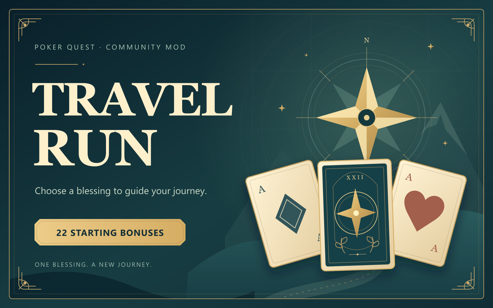

# Poker Quest TRAVEL RUN



[Editable SVG cover](assets/TravelRun-cover.svg)

22 项新增开局增益，每局选择一项祝福。支持 **Windows x64 / 原版 v63、build 2021**。

## 玩家安装

1. 在 [Releases](https://github.com/Celestial-Plato/poker-quest-travel-run/releases) 下载 `TravelRun-Installer-v0.3.6.zip` 和校验文件，解压整个 ZIP。
2. 关闭游戏，运行解压后的 `InstallTravelRun.exe`。无需安装 Python。
3. 安装器读取 Steam 注册表、Steam 库配置和游戏安装清单定位目录；找不到或找到多份安装时，会弹出文件选择窗口，请选择游戏的 `PokerQuest.exe`。
4. 从 Steam 启动游戏，选择 **New Run → Travel Run**，选择一项增益并开始新一局。

两种分发渠道：GitHub 提供完整 ZIP，无需订阅工坊；[创意工坊](https://steamcommunity.com/sharedfiles/filedetails/?id=3814137517)发布包包含同一份安装器、补丁和增益数据。任选一种方式安装，功能、共用进度和备份方式相同。两种方式均需关闭游戏并手动运行一次安装器。

安装器会备份原版程序，并安装菜单补丁和增益数据。更新时下载完整新版本 ZIP 后重新运行安装器。详见包内中英文说明与 [增益列表](EFFECTS.md)。

## 存档与恢复

共用存档与 Mod Manager 目录：`%APPDATA%\Playsaurus\PokerQuest`。Travel Run 与普通模式共用 XP、角色解锁和进度；其他已应用模组保留。安装和更新沿用原版进度，无需选择或切换存档。

进入 Travel Run 前自动备份全部 `.sol` 文件，快照位于该目录的 `TravelRun-backups`。关闭游戏后运行 `RestoreSaves.cmd`，输入一个备份文件夹路径，可手动恢复到当时的进度；还原前也会备份当前进度。

需要恢复原版时，关闭游戏，运行 `RestoreOriginal.cmd`。取消订阅不会自动还原。还原工具也缓存于 `%LOCALAPPDATA%\Playsaurus\PokerQuestTravelRun\installed-tools`。还原只接受已核对的备份和已安装程序，不覆盖未知修改。

## 开发者构建

源码包含安装器、Steam 目录识别、文件选择窗口、菜单补丁 C 源码，以及项目自己的增益数据和版本限定补丁描述。**不包含游戏原版 EXE、DLL、素材或个人存档。**

在 Windows x64 上安装 Python 3.11，并运行：

```powershell
py -3.11 -m pip install -r requirements-build.txt
py -3.11 build_release.py --channel all
```

这会编译一次共用安装器，并生成 GitHub 和工坊两个完整包；不运行安装器或游戏。也可使用 `--channel github` 或 `--channel workshop` 只生成一种渠道。工坊上传目录为 `dist/TravelRun-Workshop/content/TravelRun`。需要重编原生补丁时，在 x64 Visual Studio 开发者终端运行：

```powershell
py -3.11 native/build_native.py
py -3.11 build_release.py --channel all
```

原生补丁使用对应游戏版本的固定地址；支持新游戏版本前必须重新分析并审核地址和事件，不应放宽哈希检查。重新构建的二进制可能因编译器和时间戳不同而有不同哈希，构建脚本会更新对应清单。

## English

Download and extract the complete installer ZIP from Releases, close Poker Quest, run InstallTravelRun.exe, then launch through Steam and choose New Run → Travel Run. No Python is required for players. If Steam discovery fails, select PokerQuest.exe in the file picker.

Windows x64 / Poker Quest v63, build 2021 only. The native menu needs this installer; subscribing to the Workshop CSV/docs alone is insufficient. The GitHub package also works independently of a Workshop subscription. Shares normal progress, XP, hero unlocks and Mod Manager data. Opening Travel Run first backs up progress; use RestoreSaves.cmd for manual recovery. RestoreOriginal.cmd restores the verified original executable.

This is an unofficial community modification.
